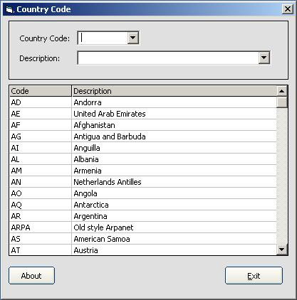



## ArkangheL

### Description

This sample program is just used to show you how to load the entire Database into MSFlexGrid using ADO and SQL command.You can view and search all country Code by just a click.
 
### More Info
 

             |
---                |---
**Submitted On**   |2002-08-17 17:19:04
**By**             |[Michael Dungog](https://github.com/Planet-Source-Code/PSCIndex/blob/master/ByAuthor/michael-dungog.md)
**Level**          |Intermediate
**User Rating**    |5.0 (10 globes from 2 users)
**Compatibility**  |VB 6\.0
**Category**       |[Databases/ Data Access/ DAO/ ADO](https://github.com/Planet-Source-Code/PSCIndex/blob/master/ByCategory/databases-data-access-dao-ado__1-6.md)
**World**          |[Visual Basic](https://github.com/Planet-Source-Code/PSCIndex/blob/master/ByWorld/visual-basic.md)
**Archive File**   |[ArkangheL1192408172002\.zip](https://github.com/Planet-Source-Code/michael-dungog-arkanghel__1-38041/archive/master.zip)

